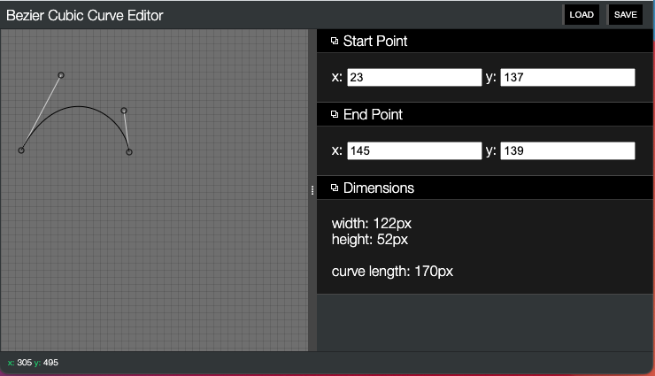

# editor-curve
a simple editor for bezier curve creation and editing




## usage
```bash
serve -p 5000
```

Then open http://localhost:5000 in a browser.


## acknowledgements

The bezier curve functions were adapted from the wonderful https://github.com/Pomax/bezierjs
